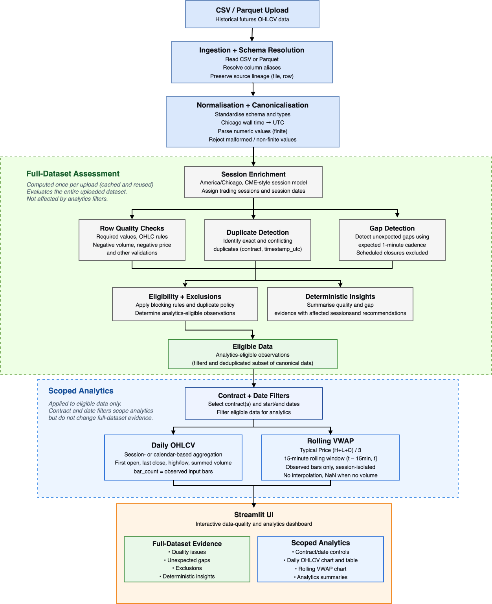

# Market Data Quality & Analytics

A Streamlit application for historical futures OHLCV data, supporting CSV and
Parquet uploads. It assesses data quality and completeness, derives
analytics-eligible observations, and calculates trading-session OHLCV and rolling
bar-based VWAP. Deterministic insights summarise existing quality evidence and
suggest validation or cleansing controls without an LLM.

## Architecture



Quality assessment covers the full uploaded canonical dataset. Contract and date
filters scope analytics only: narrowing a chart selection cannot hide quality
findings, gaps, exclusions or insights.

## Key capabilities

- **Ingestion:** CSV/Parquet reading, explicit source-column alias resolution and
  observation lineage through `source_file` and `source_row`.
- **Canonicalisation:** Chicago wall time to timezone-aware UTC, numeric parsing,
  and rejection of malformed timestamps or malformed/non-finite OHLCV values.
- **Data quality:** missing required values, OHLC consistency, negative volume,
  non-blocking negative-price warnings, and exact/conflicting duplicates.
- **Completeness:** contract-specific, session-aware gap detection with scheduled
  breaks and weekends separated from unexpected gaps.
- **Analytics:** session-level daily OHLCV, elapsed-time rolling 15-minute VWAP,
  and exact contract/inclusive trading-date filtering.
- **Insights:** reproducible summaries, distinct-observation counts for quality
  rules, gap-interval counts, affected sessions and advisory recommendations.

## Quick start

Python **3.11 or later** is required. From the repository root, create and activate
the environment using the commands for your platform.

**macOS / Linux**

```bash
python3.11 -m venv .venv
source .venv/bin/activate
```

**Windows PowerShell**

```powershell
py -3.11 -m venv .venv
.\.venv\Scripts\Activate.ps1
```

For Windows Command Prompt, use `.venv\Scripts\activate.bat` to activate instead.

Then install and launch on either platform:

```bash
python -m pip install -e ".[dev]"
streamlit run app.py
```

For a newer supported Python version, use its interpreter in the first command.
The development extra installs pytest and Ruff alongside the application
requirements. Pandas and PyArrow handle tabular data; Plotly and Streamlit provide
visualisation and the dashboard. Open the local URL printed by Streamlit, then
upload one of the minute/demo files listed below.

The application runs locally. No API key, external service or LLM configuration
is required.

## Input data

Each source must contain one supported column for every logical field:

| Logical field | Supported source column names |
|---|---|
| Contract | `contract_symbol` or `contract` |
| Timestamp | `timestamp_chicago_wall` or `timestamp` |
| Open | `open` |
| High | `high` |
| Low | `low` |
| Close | `close` |
| Volume | `volume` |

Matching is exact and case-sensitive. Missing fields or multiple matching aliases
fail schema validation rather than silently choosing a column. Optional `exchange`
and `root` metadata are preserved; unrelated source columns are not carried into
analytics. `source_row` is the zero-based ordinal in the loaded file, not its
physical CSV line number.

Naive timestamps, including the supplied Chicago wall-time column, are interpreted
in `America/Chicago` and canonicalised to timezone-aware UTC. Already-aware values
are converted to UTC. Ambiguous or nonexistent DST wall times are rejected rather
than guessed; numeric epoch units are not inferred. Each timestamp column must
use a homogeneous timezone representation.

Non-missing canonical OHLCV values must be finite. Malformed/non-finite rows retain
original structural evidence in backend rejection results and do not reach
analytics. Actual source nulls remain canonical for missing-value quality checks.
Finite negative volume therefore reaches quality assessment rather than being
rejected as a parsing failure. File parsing and structural failures produce
controlled upload errors.

## How to use the dashboard

1. **Upload a CSV or Parquet file.** Start with the multi-contract demo for a
   compact example, or the supplied ESZ25 minute file for broader historical data.
2. **Review Dataset overview.** Source, canonical, rejected and eligible counts
   distinguish ingestion outcomes from analytical inclusion. Canonical rows can
   still contain quality defects.
3. **Choose analytics scope.** Select contracts and an inclusive trading-session
   date range. Clearing all contracts produces empty analytics; selecting all
   leaves contracts unrestricted.
4. **Explore analytics.** Daily market view shows session OHLC candles, volume and
   observed-coverage diagnostics. Intraday VWAP compares Close with rolling VWAP
   for one contract/session, defaulting to the latest available session.
5. **Review Data Quality.** Inspect findings, unexpected gap intervals and
   observation exclusions, with supporting evidence and source lineage.
6. **Review Insights.** Read deterministic summaries, affected sessions and
   suggested controls. Recommendations do not repair data or change eligibility.

Assessment evidence remains visible when analytics scope is empty, unavailable or
has a reversed date range. Upload/configuration results are cached; contract/date
changes reuse assessment and rerun only filtering and analytics. Chart selectors
change presentation only.

## Important assumptions

**Trading sessions.** Defaults use `America/Chicago`, opening Sunday at 17:00
inclusive and closing Friday at 16:00 exclusive, with a daily `[16:00, 17:00)`
scheduled break. This is a declared simplified CME-style overnight model, without
an authoritative holiday or early-close exchange calendar. `session_date` is the
local closing date: Sunday evening belongs to Monday's session.

**Gap detection.** The default expected cadence is one minute. Unexpected gaps
mean expected timestamps are absent under that cadence/session model; they do
**not** prove source records were lost. Only bounded intervals between observations
are assessed, without assuming coverage before the first or after the last.
Sparse historical coverage can yield many inferred gaps. Contracts are assessed
independently, so another contract cannot fill a missing interval.

**VWAP.** OHLCV bars cannot reconstruct true trade-level VWAP. The single chosen
proxy is `Typical Price = (High + Low + Close) / 3`, weighted by observed bar
volume over `(t - 15 minutes, t]`. The window uses elapsed time, not fifteen rows,
and is isolated by contract and trading session. Zero-volume bars contribute no
weight; zero rolling volume returns unavailable/NaN VWAP.

**Daily OHLCV.** Default aggregation groups active eligible observations by contract
and trading-session closing date. Open/Close are chronological first/last prices,
High/Low are extrema and Volume is summed. `bar_count` measures observed contributing
bars, not session completeness.

**Repair.** No automatic correction, interpolation or synthetic market bars are
introduced. Chart-only null separators prevent lines bridging absent timestamps;
the analytical data and supporting tables still contain only actual observations.

## Data-quality behaviour

Canonical means standardised, not clean or analytics-eligible. Quality findings
retain the original canonical evidence; a separate eligibility stage derives the
observations used by analytics.

| Finding | Reporting and analytical treatment |
|---|---|
| Missing required values | Blocking error; exclude the observation |
| Invalid OHLC relationships | Blocking error; exclude the observation |
| Negative volume | Blocking error; exclude the observation |
| Conflicting duplicates | Blocking error; exclude every participant |
| Negative prices | Non-blocking warning; retain unless another finding blocks |
| Exact duplicates | Non-blocking warning; retain one eligible representative |

OHLC consistency requires High to be at least Open, Close and Low, and Low to be
at most Open and Close. Zero volume and valid no-range bars are accepted. Negative
futures prices are review evidence, not intrinsically invalid prices.

Duplicate identity is `(contract, timestamp_utc)`; classification compares OHLCV,
not lineage or metadata. Exact duplicates retain the eligible representative with
smallest `source_file`, then `source_row`, providing a deterministic tie-break.
Conflicts are not averaged or arbitrarily reconciled. Gap warnings do not remove
otherwise valid observed bars.

Quality issue totals count findings, which may share an observation. Gap totals
count intervals; their `missing_count` counts missing expected timestamps.
Exclusion totals count distinct source observations. Clean row-quality results
can therefore coexist with completeness warnings and no exclusions.

## Validation

Validation combines three evidence sources:

- **Supplied ESZ25 minute data:** realistic ingestion, timezone/session attribution,
  completeness, analytics and trading-date filtering.
- **Derived ESZ25 + ESH26 fixture:** unchanged supplied observations exercise
  real multi-contract filtering, chart selection and assessment-scope independence.
- **Synthetic/unit fixtures:** controlled defects absent from the supplied minute
  files, including malformed/non-finite input, DST ambiguity/nonexistence, invalid
  OHLC, negative volume, exact/conflicting duplicates and corrupt Parquet reading.

Tests also protect session and rolling-window boundaries, zero-volume behaviour,
input preservation, deterministic duplicate selection and cache-copy isolation.
Backend integration protects assessment-before-scope. Streamlit interaction tests
verify that empty or invalid analytics selections preserve full-dataset evidence
without reassessment.

Supplied daily bars are selective diagnostic references, not reconciliation truth
for minute-derived daily bars. Their Close, Volume and aggregation conventions
are unspecified, so derived bars are not forced to match them.

## Demo data

| Repository path | Purpose |
|---|---|
| [ESZ25 minute sample](src/market_quality/data/sample/minute/CME/ES/ESZ25.parquet) | Historical single-contract dashboard input |
| [ESH26 minute sample](src/market_quality/data/sample/minute/CME/ES/ESH26.parquet) | Supplied companion contract |
| [ESZ25 daily reference](src/market_quality/data/sample/daily/CME/ES/ESZ25.parquet) | Diagnostic cross-checks; not a minute-schema upload |
| [Reference metadata](src/market_quality/data/reference/) | `schema.json` documents source/time semantics; `files.csv` records the broader source inventory and checks |
| [Multi-contract demo](src/market_quality/data/demo/multi_contract_sample.parquet) | Compact ESZ25/ESH26 dashboard and integration fixture |

`multi_contract_sample.parquet` concatenates unchanged original ESZ25 and ESH26
observations from the sessions closing on 16–17 October 2025. Values are not
synthetically generated or altered to introduce defects. Provenance and the
cadence-dependent completeness results are recorded in the
[demo README](src/market_quality/data/demo/README.md).

## Project structure

```text
.
├── app.py                         # Streamlit entry point and assessment cache
├── pyproject.toml                 # Package, dependencies and tooling
├── src/market_quality/
│   ├── ingestion/                 # Readers, schema resolution and canonicalisation
│   ├── sessions/                  # Local trading-session enrichment
│   ├── quality/                   # Rules, duplicates, gaps and eligibility
│   ├── analytics/                 # Scope filtering, daily OHLCV and VWAP
│   ├── insights/                  # Deterministic evidence summaries
│   ├── ui/                        # Upload adapter and presentation
│   ├── data/                      # Supplied samples, reference metadata and demo
│   └── pipeline.py                # Backend orchestration
├── tests/                         # Unit and integration regressions
└── docs/
    └── architecture.svg           # Architecture overview
```

## Running tests

With the development installation and virtual environment activated, run from the
repository root:

```bash
pytest
ruff check .
```

The test suite includes backend integration and non-visual Streamlit interaction
tests. Ruff provides the configured Python lint checks.
